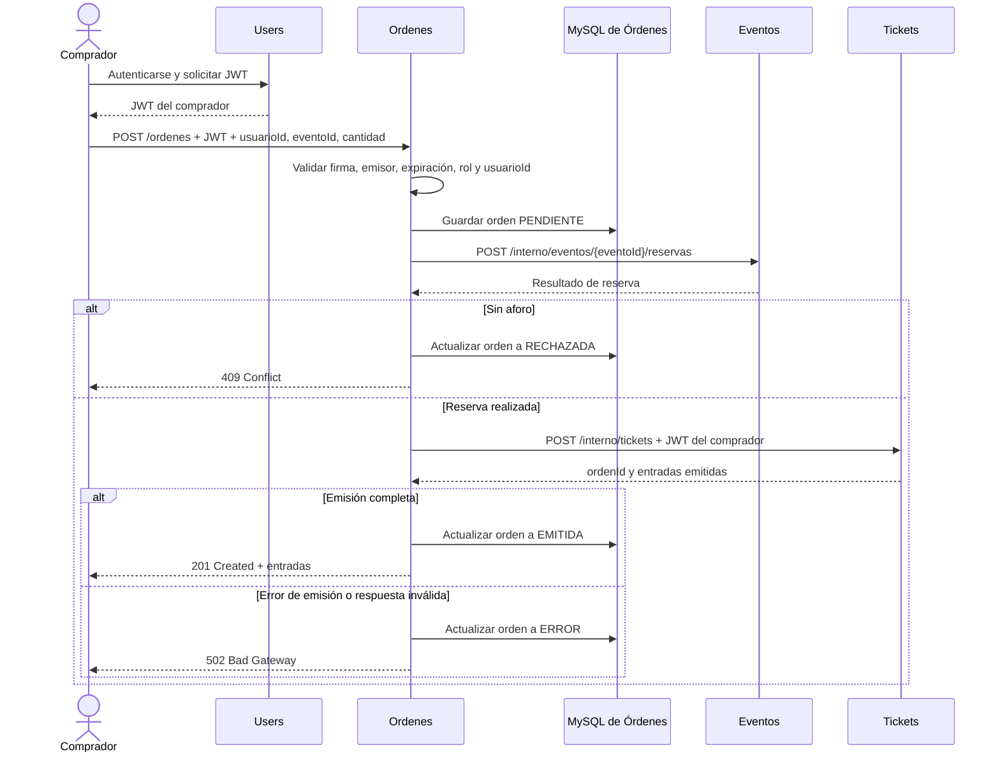

# EventPass — Microservicio de Órdenes

Microservicio responsable de coordinar la compra de entradas en EventPass. Recibe la solicitud del comprador, valida su identidad mediante el JWT compartido, solicita una reserva de aforo a Eventos y, si la reserva resulta exitosa, pide a Tickets que emita las entradas. Órdenes registra el resultado de la operación en su propia base de datos.

Este repositorio documenta la implementación académica actual y su contrato de comunicación con Eventos y Tickets.

## Responsabilidades

- Crear y consultar órdenes.
- Validar que el JWT sea válido, pertenezca al emisor configurado, tenga rol `COMPRADOR` y corresponda al `usuarioId` enviado.
- Persistir la orden con estado inicial `PENDIENTE`.
- Solicitar la reserva de aforo al microservicio de Eventos.
- Solicitar la emisión de entradas a Tickets, reenviando el Bearer token del comprador.
- Guardar el resultado final: `EMITIDA`, `RECHAZADA` o `ERROR`.

Cada microservicio conserva su propia base de datos. Órdenes no consulta directamente las bases de Eventos, Tickets ni Users; se comunica con los otros servicios mediante HTTP.

## Tecnologías

| Componente | Tecnología |
| --- | --- |
| Lenguaje | Java 17 |
| Framework | Spring Boot 4.1.1 |
| Construcción | Maven Wrapper |
| API | Spring Web MVC / REST |
| Persistencia | Spring Data JPA / Hibernate |
| Base de datos | MySQL 8 |
| Autenticación entre servicios | JWT firmado con HMAC (JJWT) |

## Puertos y dependencias

| Servicio | Puerto local | Uso desde Órdenes |
| --- | ---: | --- |
| Users | 8080 | Emite el JWT del comprador; el comprador lo entrega a Órdenes |
| Tickets | 8081 | Recibe la solicitud interna de emisión de entradas |
| Órdenes | 8083 | Orquesta y registra la compra |
| Eventos | 8084 | Recibe la solicitud interna de reserva de aforo |
| MySQL de Órdenes | 3307 (host) | Base de datos exclusiva de este servicio |

Las URL de Eventos y Tickets se configuran en el `.env`. Los puertos indicados son los valores locales de esta integración; pueden cambiar según el entorno.

## API

Base URL local: `http://localhost:8083`

| Método | Ruta | Autenticación | Descripción |
| --- | --- | --- | --- |
| `POST` | `/ordenes` | Bearer JWT de comprador | Coordina una compra y registra su resultado |
| `GET` | `/ordenes/{ordenId}` | No requerida actualmente | Consulta una orden por su identificador |

### Crear una orden

```http
POST /ordenes
Content-Type: application/json
Authorization: Bearer <token-del-comprador>
```

```json
{
  "usuarioId": 12,
  "eventoId": 34,
  "cantidad": 2
}
```

Los tres valores deben ser positivos. El `usuarioId` debe coincidir con el `sub` del JWT. El token debe tener el emisor configurado en `JWT_ISSUER` y el claim `rol` con valor `COMPRADOR`.

#### Compra emitida — `201 Created`

```json
{
  "ordenId": 101,
  "usuarioId": 12,
  "eventoId": 34,
  "cantidad": 2,
  "estado": "EMITIDA",
  "fecha": "2026-10-09T14:30:00",
  "motivo": null,
  "tickets": [
    { "ticketId": 501, "codigo": "CODIGO-1" },
    { "ticketId": 502, "codigo": "CODIGO-2" }
  ]
}
```

Los identificadores, códigos y fecha son ilustrativos. Los nombres de los campos reflejan la respuesta implementada.

#### Compra rechazada por falta de aforo — `409 Conflict`

```json
{
  "ordenId": 102,
  "usuarioId": 12,
  "eventoId": 34,
  "cantidad": 2,
  "estado": "RECHAZADA",
  "fecha": "2026-10-09T14:31:00",
  "motivo": "AFORO_INSUFICIENTE",
  "tickets": null
}
```

#### Error al comunicarse con un servicio — `502 Bad Gateway`

Cuando Eventos o Tickets falla, o Tickets devuelve una cantidad de entradas distinta a la solicitada, la orden queda en `ERROR`. El campo `motivo` contiene el código entregado por la integración o `CANTIDAD_TICKETS_INCORRECTA`.

```json
{
  "ordenId": 103,
  "usuarioId": 12,
  "eventoId": 34,
  "cantidad": 2,
  "estado": "ERROR",
  "fecha": "2026-10-09T14:32:00",
  "motivo": "CANTIDAD_TICKETS_INCORRECTA",
  "tickets": null
}
```

#### Validaciones de solicitud y token

- `400 Bad Request`: falta un identificador/cantidad válido o alguno no es positivo.
- `401 Unauthorized`: falta el Bearer token, la firma no es válida, el token expiró o el emisor no coincide.
- `403 Forbidden`: el rol no es `COMPRADOR` o el `usuarioId` no coincide con el usuario autenticado.

Spring produce el cuerpo de error para estas respuestas; actualmente no se define un DTO de error propio para ellas.

### Consultar una orden

```http
GET /ordenes/101
```

Respuesta `200 OK`:

```json
{
  "ordenId": 101,
  "usuarioId": 12,
  "eventoId": 34,
  "cantidad": 2,
  "estado": "EMITIDA",
  "fecha": "2026-10-09T14:30:00"
}
```

La consulta no exige autenticación ni comprueba propiedad de la orden en la implementación actual. Si el identificador no existe, actualmente se produce un error interno; el manejo explícito de `404 Not Found` queda pendiente.

## Flujo de compra

El comprador obtiene primero un JWT de Users y lo presenta al crear la orden. Órdenes valida el token, registra la solicitud y coordina las llamadas síncronas a los otros dos servicios.



### Contratos internos utilizados

Órdenes llama a los siguientes endpoints configurados para la integración local:

1. Eventos: `POST {EVENTOS_URL}/interno/eventos/{eventoId}/reservas`, enviando `{ "ordenId": 101, "cantidad": 2 }`.
2. Tickets: `POST {TICKETS_URL}/interno/tickets`, enviando `{ "ordenId": 101, "usuarioId": 12, "eventoId": 34, "cantidad": 2 }` y el mismo `Authorization: Bearer ...` validado al inicio.

La respuesta de Tickets debe incluir `ordenId` y una lista `tickets` cuya cantidad sea igual a la solicitada. Órdenes verifica la cantidad antes de marcar la compra como emitida.

## Configuración local

### Requisitos

- JDK 17.
- Docker Desktop y Docker Compose para levantar la base de datos local, o una instancia MySQL compatible.
- Microservicios de Eventos y Tickets ejecutándose para probar el flujo completo.

### Variables de entorno

En la raíz del repositorio, copia `.env.example` a `.env` y configura el secreto real compartido con Users y Tickets:

```powershell
Copy-Item .env.example .env
```

No reemplaces el secreto compartido por uno distinto en cada servicio: los tres deben verificar los JWT con la misma clave y configuración de emisor. No publiques ni incluyas `.env` en commits.

Variables principales:

| Variable | Valor local sugerido | Descripción |
| --- | --- | --- |
| `SERVER_PORT` | `8083` | Puerto HTTP de Órdenes |
| `EVENTOS_URL` | `http://localhost:8084` | Dirección base de Eventos |
| `TICKETS_URL` | `http://localhost:8081` | Dirección base de Tickets |
| `DB_URL` | `jdbc:mysql://localhost:3307/db_ordenes?...` | Conexión a la base propia de Órdenes |
| `DB_USERNAME` | `root` | Usuario de MySQL local |
| `DB_PASSWORD` | vacío | Compose local habilita root sin contraseña |
| `MYSQL_HOST_PORT` | `3307` | Puerto MySQL publicado en el host |
| `JWT_SECRET_BASE64` | valor del entorno Users/Tickets | Secreto compartido codificado en Base64 |
| `JWT_ISSUER` | `eventpass-users` | Emisor que se exige al validar el JWT |

### Levantar MySQL

El Compose de este repositorio crea únicamente `db_ordenes`; no crea ni comparte bases de datos con los demás microservicios.

```powershell
docker compose -f compose.mysql.yaml up -d
```

Compose publica MySQL en `127.0.0.1:3307` y conserva los datos en el volumen `eventpass-mysql-data`. Para detener el contenedor:

```powershell
docker compose -f compose.mysql.yaml down
```

El esquema `ordenes` se crea o actualiza al iniciar la aplicación porque Hibernate está configurado con `spring.jpa.hibernate.ddl-auto=update`.

### Ejecutar Órdenes

Desde la raíz del proyecto, en PowerShell:

```powershell
.\mvnw.cmd spring-boot:run
```

La API quedará disponible en `http://localhost:8083` salvo que se configure otro `SERVER_PORT`.

## Prueba manual con Postman

Para recorrer la compra completa, Users, Eventos, Tickets, MySQL de Órdenes y Órdenes deben estar disponibles y configurados con las direcciones y el secreto JWT correspondientes.

1. Autentícate en Users como comprador y copia el JWT.
2. Envía `POST http://localhost:8083/ordenes` con `Content-Type: application/json`, `Authorization: Bearer <JWT>` y un JSON con `usuarioId`, `eventoId` y `cantidad` válidos.
3. Para el caso exitoso, espera `201 Created`, estado `EMITIDA` y la cantidad solicitada de entradas.
4. Repite con un evento sin aforo para comprobar `409 Conflict` y estado `RECHAZADA`.
5. Prueba sin token y con un `usuarioId` diferente al del JWT para comprobar `401` y `403` respectivamente.
6. Consulta el resultado con `GET http://localhost:8083/ordenes/{ordenId}`.

La verificación manual realizada hasta ahora confirmó que Órdenes inicia y crea la tabla `ordenes` en la base local. El flujo completo entre microservicios todavía requiere una prueba integrada con Eventos y Tickets levantados juntos.

## Alcance y limitaciones conocidas

- La coordinación es síncrona mediante HTTP; Órdenes espera las respuestas de Eventos y Tickets.
- La base MySQL de Órdenes es independiente. La transacción local no puede revertir por sí sola una reserva ya aceptada por Eventos si después falla la emisión de Tickets; no hay compensación automática implementada.
- No existe todavía una política de reintentos/idempotencia de la compra en Órdenes.
- `GET /ordenes/{ordenId}` no valida autenticación ni propiedad de la orden.
- Los errores de orden inexistente aún no se convierten expresamente en `404 Not Found`.
- El alcance actual no contempla reembolsos ni liberación de entradas.
- No se incluye despliegue en AWS en esta guía; el objetivo aquí es el contrato de integración local evaluado.

## Estructura del código

```text
src/main/java/com/event_pass/ordenes/
├── client/       # Clientes HTTP para Eventos y Tickets
├── config/       # Configuración de la aplicación
├── controller/   # Endpoints REST
├── dto/          # Contratos de solicitud y respuesta
├── exception/    # Errores de servicios externos
├── model/        # Entidad Orden y estados
├── repository/   # Persistencia JPA
├── security/     # Validación del JWT compartido
└── service/      # Orquestación de la compra
```

## Flujo de ramas

El repositorio utiliza `main` para la versión estable, `develop` como rama de integración y ramas `feature/*` para cambios funcionales. Las ramas de trabajo se proponen para revisión mediante PR hacia `develop`; el PR y su revisión los realiza el equipo.
